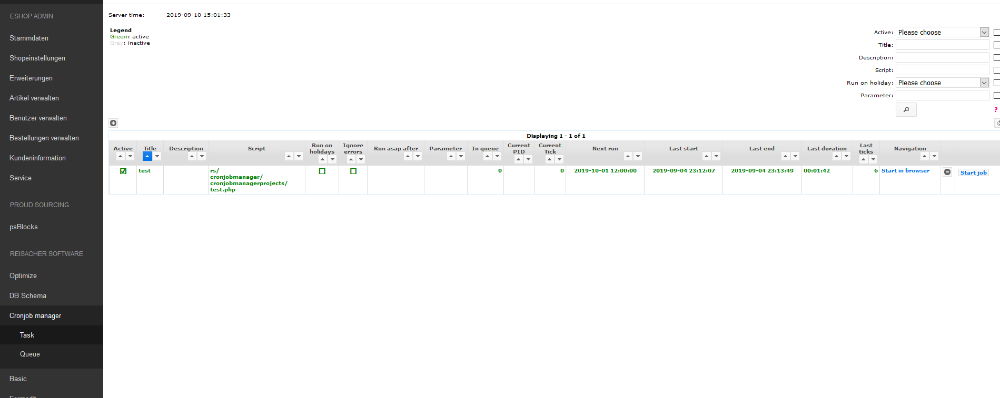
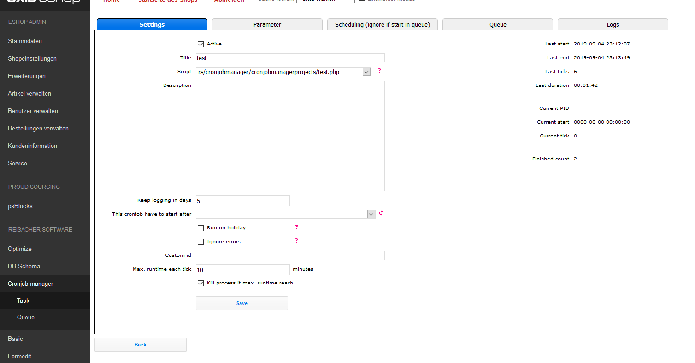

# Oxid cronjobmanager (beta)

## Description

Manage your cronjobs which a nice UI. Develop your cronjob in php without change server settings. Have full control and logs for each cronjob.

This module need the "oxid-formedit", "oxid-base" repository installed in the shop.

## Requirements

"oxid-basic", "oxid-formedit" module required. 

## Install

1. Copy files into following directory

        source/modules/rs/cronjobmanager
          
2. Add to composer.json at shop root
  
        "autoload": {
            "psr-4": {
                "rs\\cronjobmanager\\": "./source/modules/rs/cronjobmanager"
            }
        },
    
3. Execute following command:

        composer require dragonmantank/cron-expression --no-update
        composer update --no-plugins --no-scripts --no-dev --ignore-platform-reqs

3. Refresh autoloader files with composer in the oxid root directory.

        composer dump-autoload
        
4. Execute in Database

        CREATE TABLE `cpcronjob` (
         `cpid` char(32) CHARACTER SET latin1 COLLATE latin1_general_ci NOT NULL,
         `cpactive` tinyint(1) NOT NULL DEFAULT 0,
         `cpcreated` datetime NOT NULL DEFAULT current_timestamp(),
         `cptitle` varchar(250) DEFAULT NULL COMMENT 'title of the cronjob',
         `cpscript` varchar(1000) DEFAULT NULL COMMENT 'relative path start from the BASE/modules folder',
         `cpdescription` text DEFAULT NULL COMMENT 'description what the cronjob does',
         `cprun_on_holiday` tinyint(1) NOT NULL DEFAULT 0 COMMENT 'should the cronjob run on holidays',
         `cpkeep_logging_in_days` int(11) NOT NULL DEFAULT 0 COMMENT 'keep the log 5 days until clear',
         `cpignore_errors` tinyint(1) NOT NULL DEFAULT 0 COMMENT 'Don´t stop cronjob if an error throw',
         `f_cpcronjob_parent` char(32) CHARACTER SET latin1 COLLATE latin1_general_ci DEFAULT NULL,
         `cpcurrent_pid` varchar(32) DEFAULT NULL COMMENT 'current process id on the linux system, if cronjob was started',
         `cpcurrent_start` datetime DEFAULT NULL COMMENT 'when the current run start',
         `cpcurrent_tick` int(11) NOT NULL DEFAULT 0 COMMENT 'current tick of the current run',
         `cplast_start` datetime DEFAULT NULL COMMENT 'when the cronjob the last time start',
         `cplast_end` datetime DEFAULT NULL COMMENT 'when the last cronjob the last time end',
         `cplast_ticks` int(11) NOT NULL DEFAULT 0 COMMENT 'how many ticks has the cronjob needed',
         `cpfinished_count` int(11) NOT NULL DEFAULT 0 COMMENT 'how often the cronjob finished',
         `cpcustom_id` varchar(250) DEFAULT '' COMMENT 'unique value to identify the cronjob',
         `cpmax_runtime_timeout` int(11) DEFAULT 10 COMMENT 'how long can a cronjob tick execute until it will cancel in minutes',
         `cpkill_process_after_max_runtime` tinyint(1) NOT NULL DEFAULT 1 COMMENT 'Kill process after runtime, otherwise send only a message',
         PRIMARY KEY (`cpid`),
         KEY `f_cpcronjob_parent` (`f_cpcronjob_parent`)
        ) ENGINE=InnoDB DEFAULT CHARSET=utf8 COMMENT='define a cronjob';
        
        CREATE TABLE `cpcronjob_log` (
         `cpid` char(32) CHARACTER SET latin1 COLLATE latin1_general_ci NOT NULL,
         `f_cpcronjob` char(32) CHARACTER SET latin1 COLLATE latin1_general_ci NOT NULL,
         `f_cpcronjob_queue` char(32) CHARACTER SET latin1 COLLATE latin1_general_ci NOT NULL,
         `cpcreated` datetime NOT NULL DEFAULT current_timestamp(),
         `cptype` enum('runtime','output','error','finish') DEFAULT 'output' COMMENT 'type of the log',
         `cpsort_order` int(11) NOT NULL AUTO_INCREMENT COMMENT 'use for sorting',
         `cptick` int(11) NOT NULL DEFAULT 0 COMMENT 'that that this type occure',
         `cplog` longtext DEFAULT NULL COMMENT 'log message compressed',
         PRIMARY KEY (`cpsort_order`),
         UNIQUE KEY `cpid` (`cpid`),
         KEY `f_cpcronjob` (`f_cpcronjob`),
         KEY `f_cpcronjob_queue` (`f_cpcronjob_queue`),
         CONSTRAINT `cpcronjob_log_f_cpcronjob` FOREIGN KEY (`f_cpcronjob`) REFERENCES `cpcronjob` (`cpid`) ON DELETE CASCADE ON UPDATE CASCADE
        ) ENGINE=InnoDB AUTO_INCREMENT=154 DEFAULT CHARSET=utf8 ROW_FORMAT=COMPRESSED COMMENT='log of an cronjob';
        
        CREATE TABLE `cpcronjob_parameter` (
         `cpid` char(32) CHARACTER SET latin1 COLLATE latin1_general_ci NOT NULL,
         `f_cpcronjob` char(32) CHARACTER SET latin1 COLLATE latin1_general_ci NOT NULL,
         `cpactive` tinyint(1) NOT NULL DEFAULT 0,
         `cpname` varchar(250) DEFAULT NULL COMMENT 'name of the parameter',
         `cpvalue` varchar(250) DEFAULT NULL COMMENT 'value of the parameter',
         `cpdescription` text DEFAULT NULL,
         PRIMARY KEY (`cpid`),
         KEY `f_cpcronjob` (`f_cpcronjob`),
         CONSTRAINT `cpcronjob_parameter_f_cpcronjob` FOREIGN KEY (`f_cpcronjob`) REFERENCES `cpcronjob` (`cpid`) ON DELETE CASCADE ON UPDATE CASCADE
        ) ENGINE=InnoDB DEFAULT CHARSET=utf8 COMMENT='parameter that the cronjob need to start';
        
        CREATE TABLE `cpcronjob_queue` (
         `cpid` char(32) CHARACTER SET latin1 COLLATE latin1_general_ci NOT NULL,
         `f_cpcronjob` char(32) CHARACTER SET latin1 COLLATE latin1_general_ci NOT NULL COMMENT 'which cronjob should call',
         `cpparameter` text DEFAULT NULL COMMENT 'parameter which should use (json)',
         `cpcreated` datetime NOT NULL DEFAULT current_timestamp() COMMENT 'when was the item created',
         `cpcurrent_pid` varchar(32) DEFAULT NULL COMMENT 'current process id on the linux system, if cronjob was started',
         `cpcurrent_start` datetime DEFAULT NULL COMMENT 'when the current run start',
         `cpcurrent_tick` int(11) NOT NULL DEFAULT 0 COMMENT 'current tick of the current run',
         `cpcustomer_id` varchar(250) CHARACTER SET latin1 COLLATE latin1_general_ci DEFAULT NULL COMMENT 'create your own id. If id is present, the item won´t add to the queue.',
         `cpdescription` varchar(250) DEFAULT NULL COMMENT 'your description like the origin script',
         PRIMARY KEY (`cpid`),
         KEY `f_cpcronjob` (`f_cpcronjob`),
         KEY `cpcustomer_id` (`cpcustomer_id`),
         CONSTRAINT `cpcronjob_queue_f_cpcronjob` FOREIGN KEY (`f_cpcronjob`) REFERENCES `cpcronjob` (`cpid`) ON DELETE CASCADE ON UPDATE CASCADE
        ) ENGINE=InnoDB DEFAULT CHARSET=utf8;
        
        CREATE TABLE `cpcronjob_scheduling` (
         `cpid` char(32) CHARACTER SET latin1 COLLATE latin1_general_ci NOT NULL,
         `f_cpcronjob` char(32) CHARACTER SET latin1 COLLATE latin1_general_ci NOT NULL,
         `cpcreated` datetime NOT NULL DEFAULT current_timestamp(),
         `cpactive` tinyint(1) NOT NULL DEFAULT 0,
         `cpscheduling` varchar(100) DEFAULT NULL COMMENT 'cronjob scheduling settings',
         PRIMARY KEY (`cpid`),
         KEY `f_cpcronjob` (`f_cpcronjob`),
         CONSTRAINT `cpcronjob_scheduling_f_cpcronjob` FOREIGN KEY (`f_cpcronjob`) REFERENCES `cpcronjob` (`cpid`) ON DELETE CASCADE ON UPDATE CASCADE
        ) ENGINE=InnoDB DEFAULT CHARSET=utf8 COMMENT='scheduling times, when a cronjob should start';
        
5. Enable module in the oxid admin area, Extensions => Modules
    
## SETUP

Change the path to the php interpreter in the file "config.inc.php" in the module root.

Change the mail address in the "config.inc.php". To this mail some error will send if an error happen.

Set up a server cronjob that call following file every minute:

    /#ABSOLUTE_PATH#/source/modules/rs/cronjobmanager/cronjobmanager/start.php

**Profihost**

As example there is a start_profihost.sh wrapper for the start.php above. 
Also Profihost only allow execute the cronjob each 30 minutes. The cronjob file needs 755 rights. 

https://wissen.profihost.com/wissen/artikel/wie-richte-ich-einen-cronjob-ein/

https://wissen.profihost.com/wissen/artikel/wie-erstelle-ich-ein-wrapper-skript-fuer-einen-shopware-cronjob/

## Manual

You can start the cronjob for one tick manually (debugging) by execute following link (modify the link so it fit to your clone):
    
    #URL_TO_THE_SHOP#/modules/rs/cronjobmanager/cronjobmanager/start.php